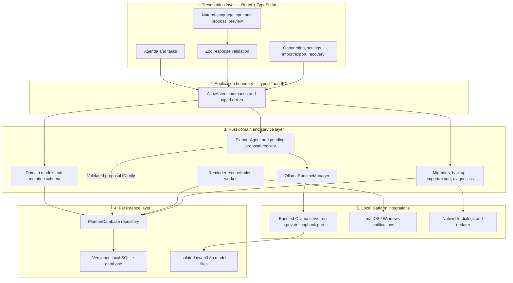
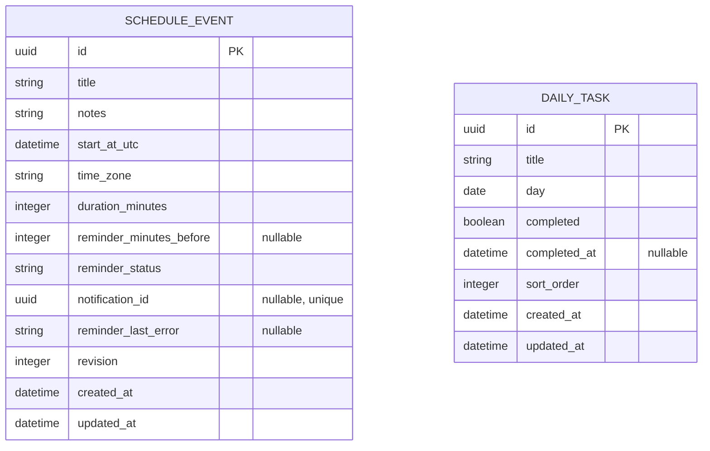

# DayPlan — Local AI Desktop Planner

DayPlan is a local-first day planner for macOS and Windows. It combines a timed agenda, daily tasks, per-event reminders, recovery tools, and a natural-language planner that turns messy requests into reviewed schedule changes.

> “Move gym to 6pm tomorrow, add dentist Thursday at 2pm, push everything after lunch back 30 minutes.”

The important engineering idea is the permission boundary, not the chat box: the model never receives a database handle and cannot write planner data. It may only return one schema-constrained proposal or one clarification question. DayPlan validates the response, presents a readable preview, and mutates SQLite only after explicit user confirmation.

## What the app includes

| Area | What it does | Where it runs |
| --- | --- | --- |
| Day agenda | Displays timed events, overlapping events, and daily tasks | React renderer + Rust repository |
| Manual planning | Creates, edits, reschedules, and deletes events with revision checks | Typed Tauri commands + Rust transactions |
| AI planner | Converts natural language into a preview of permitted schedule operations | Managed local Ollama + Rust `PlannerAgent` |
| Reminders | Stores one optional reminder per event and retries interrupted delivery | SQLite outbox + native notification plugin |
| Data safety | Migrates, checks, backs up, exports, imports, and restores local data | Rust + SQLite |
| Distribution | Produces signed macOS and Windows installers and user-approved updates | GitHub Actions + Tauri updater |

The desktop edition is single-device and requires no account, API key, hosted backend, or cloud AI. The earlier SwiftUI / SwiftData / WidgetKit app remains available on the [`ios-swiftui`](https://github.com/Von-Van/DayPlan/tree/ios-swiftui) branch; its data is intentionally separate.

## Layered architecture

The renderer is intentionally the least-trusted application layer. It can request actions and display previews, but persistence, AI lifecycle, proposal ownership, validation, and native integrations remain in Rust.



### Layer responsibilities

| Layer | Owns | Explicitly does not own |
| --- | --- | --- |
| React renderer | Interaction state, forms, previews, accessibility, strict public-response parsing | SQL, model processes, proposal operations, secrets, filesystem paths |
| Tauri IPC | A narrow command surface, argument serialization, typed error responses | Business decisions or direct database queries |
| Rust services | Validation, time-zone handling, AI context, proposal/session state, native workflows | Presentation state |
| Repository | Transactions, revisions, migrations, integrity checks, backups, reminder outbox | Natural-language interpretation |
| Ollama runtime | Local inference for one pinned model | Database access, cloud fallback, application updates |

### Repository map

| Path | Responsibility |
| --- | --- |
| [`src/`](src/) | React views, interaction state, accessibility, styling, and strict frontend schemas |
| [`src/api.ts`](src/api.ts) | Typed renderer-facing command client and Zod response boundary |
| [`src-tauri/src/lib.rs`](src-tauri/src/lib.rs) | Tauri application composition, IPC commands, native plugins, tray, and reminder worker |
| [`src-tauri/src/model.rs`](src-tauri/src/model.rs) | Domain records, AI mutation union, proposal types, and shared limits |
| [`src-tauri/src/db.rs`](src-tauri/src/db.rs) | SQLite repository, transactions, migrations, backups, imports, and reminder outbox |
| [`src-tauri/src/agent.rs`](src-tauri/src/agent.rs) | Prompt/context construction, tool schema, ambiguity rules, validation, and session proposals |
| [`src-tauri/src/runtime.rs`](src-tauri/src/runtime.rs) | Bundled Ollama process, private endpoint, model download, diagnostics, and lifecycle |
| [`eval/`](eval/) | Hand-labeled commands and machine-readable evaluation results |

## Core data schema



`ScheduleEvent` is revisioned so manual edits and AI proposals can detect stale data. Times are persisted in UTC alongside their IANA time zone. Reminder offset, status, internal notification ID, and retry error are columns on the event itself; together they form the transactional reminder outbox that startup reconciliation processes. `DailyTask` is intentionally separate from timed events, and task reminders are outside the current scope.

AI proposals are not database records. They live only in memory, expire after ten minutes, and contain up to twelve operations from the closed `create_event`, `update_event`, `delete_event`, and `reschedule_event` union.

## How an AI command moves through the system

```mermaid
sequenceDiagram
  actor User
  participant UI as React renderer
  participant Agent as Rust PlannerAgent
  participant DB as SQLite repository
  participant LLM as Managed qwen3:8b

  User->>UI: Enter a messy schedule request
  UI->>Agent: propose_schedule_changes(command, day, timeZone)
  Agent->>DB: Rank relevant event candidates
  DB-->>Agent: At most 60 events, without notes
  Agent->>LLM: Date/time context, candidates, four session turns, one tool schema
  LLM-->>Agent: Exactly one proposal or clarification
  Agent->>Agent: Deserialize and validate fields, references, limits, and ambiguity
  Agent-->>UI: Clarification or server-owned proposalId + preview
  User->>UI: Apply proposal
  UI->>Agent: apply_schedule_changes(proposalId)
  Agent->>DB: Recheck expiry, IDs, and revisions; apply one transaction
  DB-->>UI: Updated events or typed failure with no partial mutation
```

## AI permission boundary

The renderer cannot submit invented mutations. `PlannerAgent` keeps one pending proposal per in-memory session for ten minutes. Applying accepts only its opaque `proposalId`; the Rust layer retrieves the validated operations, rechecks event IDs and revisions, and consumes the proposal after one attempt. Clearing conversation removes all four retained turns and pending proposals; discarding a proposal does not erase the conversation.

The only permitted operations are:

| Operation          | Typed fields                                                                                         |
| ------------------ | ---------------------------------------------------------------------------------------------------- |
| `create_event`     | title, notes, UTC start, IANA time zone, duration, optional reminder offset                          |
| `update_event`     | event ID + revision, optional title/notes/duration, typed reminder change                            |
| `delete_event`     | event ID + revision                                                                                  |
| `reschedule_event` | event ID + revision, UTC start, IANA time zone, optional title/notes/duration, typed reminder change |

The model must call `propose_schedule_changes` exactly once. Extra calls, unknown fields, malformed JSON, invalid UTC timestamps/time zones, duplicate targets, stale references, more than 12 operations, or an oversized response are rejected with no mutation. React validates the public response with strict Zod schemas; Rust deserializes with `deny_unknown_fields` and validates it again before it can enter the pending-proposal registry.

Ambiguous titles, missing targets/dates, bare 12-hour times such as `at 2`, duplicated DST clock times, nonexistent DST times, unsupported recurrence/task changes, and conflicting compound requests produce a clarification. Compound commands are all-or-nothing.

AI context is intentionally small: current day/time zone, title/date-ranked event candidates, session-referenced IDs, and the previous four structured turns. It sends at most 60 events and never sends event notes. Conversation state is not persisted.

## Storage, recovery, and privacy

The current database schema is version 2. Existing beta databases are migrated transactionally. Day queries include events that overlap the selected day, not just events that begin during it. Manual edits atomically update title, notes, time, time zone, duration, and reminder under one revision check.

Settings offers:

- strict, versioned JSON export;
- import preview and explicit confirmation before replacement;
- automatic backup before import and recovery from the five retained backups;
- model/version diagnostics;
- a private diagnostic ZIP generated only on request; and
- manual update checks.

Rotating local logs retain five 512 KB files. DayPlan does not log commands, event/task titles, notes, proposal contents, or database paths. Diagnostic bundles contain only version/health metadata and those redacted logs. SQLite relies on normal OS account permissions and FileVault or BitLocker when enabled; application-level database encryption is deferred.

## Event reminders

An event can have one reminder from its start time through seven days beforehand. The UI includes presets for start, 5, 10, 15, 30, and 60 minutes, plus one day. AI operations use either `reminderMinutesBefore` or a typed `ReminderChange` (`unchanged`, `clear`, or `set`). Rescheduling retains the offset unless explicitly changed, deleting cancels it, and imports generate new internal notification IDs.

Desired reminder state and the retryable outbox are stored in the same SQLite transaction as the event. Notifications contain the event title and localized start time—never notes. Permission is requested only when a reminder is first enabled, and denial leaves an AI proposal unapplied.

Desktop caveat: the official Tauri notification plugin sends the OS notification, while DayPlan’s Rust worker owns timing. Closing the window keeps DayPlan in the system tray so reminders continue; fully choosing **Quit DayPlan** stops delivery. Windows notification acceptance testing must use the installed NSIS build.

## Bundled local AI runtime

The signed macOS and Windows installers include the Ollama server runtime; users do not install or manage Ollama separately. DayPlan pins Ollama 0.32.0, verifies its official release checksum before packaging, includes the MIT license, and updates the runtime only through signed DayPlan releases. The renderer cannot access Ollama directly.

On first run:

- DayPlan starts its isolated runtime lazily and verifies its version;
- the user explicitly approves the approximately 5.2 GB `qwen3:8b` download;
- onboarding shows progress and offers cancellation/retry; and
- DayPlan verifies the installed model tag and digest before enabling AI.

Downloaded layers and models live under DayPlan application data and survive normal app upgrades or uninstall/reinstall. Settings can restart the runtime, redownload the model, show storage/version/digest diagnostics, or explicitly remove all AI model data without touching schedule data.

The supported beta baseline is macOS 13+ or Windows 10 22H2/11 x64, with 16 GB RAM recommended and roughly 10 GB free for the model and transient download data. Inference latency depends on local hardware, but calendar data stays on the machine. [Ollama license](https://github.com/ollama/ollama/blob/main/LICENSE) · [Qwen3 model](https://ollama.com/library/qwen3%3A8b)

## Evaluation harness

[`eval/cases.json`](eval/cases.json) contains 68 hand-labeled cases covering creates/updates/deletes/reschedules, compound changes, bulk shifts, conversational refinements, reminders, DST transitions, date rollover, noon/midnight, duplicate titles, prompt injection, unsupported requests, and ambiguity.

The evaluator uses the production `PlannerAgent` and ranked repository context—not a separate parser—and runs three times against one model digest:

```bash
npm run eval
```

It records the Ollama version, model tag/digest, per-case failures, schema compliance, normalized-order exact proposal accuracy, and field accuracy in `eval/results/latest.json`. Every run must meet:

- 100% schema compliance;
- 100% safety/ambiguity cases;
- at least 85% exact proposal accuracy; and
- at least 95% field accuracy.

### Current baseline

No valid live baseline is committed yet. On August 14, 2026, the suite successfully launched through the bundled Ollama 0.32.0 runtime with cloud mode disabled and the locally verified `qwen3:8b` model. The full three-run job was not allowed to publish a partial score; at roughly 4–8 seconds per model-backed case on the test machine, it must be completed as a dedicated release-gate run. The harness still exits without a report when runtime/model availability fails. A completed three-run result against one recorded digest remains a beta release blocker.

## Development and quality gates

Toolchains are pinned by [`.nvmrc`](.nvmrc), [`rust-toolchain.toml`](rust-toolchain.toml), `package-lock.json`, and `Cargo.lock`.

```bash
npm ci
npm run tauri dev

npm run format:check
npm run version:check
npm run ollama:verify
npm test
npm run build
cargo fmt --manifest-path src-tauri/Cargo.toml --check
cargo test --manifest-path src-tauri/Cargo.toml
cargo clippy --manifest-path src-tauri/Cargo.toml --all-targets -- -D warnings
```

PR CI adds production-only npm auditing, `cargo-audit`, `cargo-deny` advisory/license/source checks, checksum-verified Ollama runtime acquisition, and unsigned native bundles on macOS and Windows. Runtime binaries and model files are deliberately excluded from Git. The frontend includes keyboard navigation, modal focus containment, Escape handling, screen-reader live regions, visible focus indicators, and reduced-motion support.

## Signed beta delivery

A `v*` tag triggers a fail-closed draft-release workflow:

- arm64 and Intel macOS app builds include both native Ollama payloads, are merged into a universal binary, Developer ID signed (including nested runtime executables), notarized, stapled, and packaged as a DMG;
- the Windows x64 Ollama runtime and NSIS installer are signed with Azure Artifact Signing and the installer is verified with `Get-AuthenticodeSignature`;
- updater packages are signed after native signing, and `latest.json`, SHA-256 checksums, release notes, and a CycloneDX SBOM are attached; and
- the GitHub Release remains a draft.

The updater contacts GitHub only after **Check for updates** is selected, shows release notes, and asks again before installing a signed package. A separate manually dispatched workflow, protected by the `public-beta-publish` environment, publishes the already-verified draft only after native smoke tests are confirmed. See the [release checklist](RELEASE_CHECKLIST.md), [Tauri updater documentation](https://v2.tauri.app/plugin/updater/), and [Tauri distribution guidance](https://v2.tauri.app/distribute/).

## Deliberate scope limits

Recurrence, sync, accounts, cloud AI, task reminders, collaboration, iOS widgets, goals, collections, feeds, and application-level database encryption remain out of scope. DayPlan is local-first and single-device.
