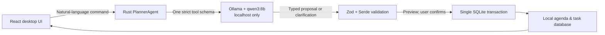

# DayPlan — Local AI Desktop Planner

DayPlan is a deliberately small, local-first day planner for macOS and Windows. It pairs a timed agenda and daily task list with an AI command bar that turns natural language into a reviewed, typed schedule proposal.

> “Move gym to 6pm tomorrow, add dentist Thursday at 2pm, push everything after lunch back 30 minutes.”

The interesting part is not the chat box: the model never receives database access and cannot write planner data. It can only propose one of four strict operations, which DayPlan validates before showing a confirmation preview. No proposal changes data until the person using the app selects **Apply**.

## Portfolio architecture



- **Tauri 2 + React + TypeScript** provides one installable desktop app for macOS and Windows.
- **SQLite** stores `ScheduleEvent` records (`id`, title, notes, UTC start, IANA time zone, duration, revision/audit timestamps) and separate `DailyTask` records.
- **Rust repositories** own all reads and writes, preserving the original DayPlan separation of typed models → store/service layer → views.
- **Ollama** runs the selected model at `http://127.0.0.1:11434`. DayPlan is local-only: it has no API key setting, cloud provider, backend, account, or silent fallback.

The previous SwiftUI / SwiftData / WidgetKit implementation is preserved on the [`ios-swiftui`](https://github.com/Von-Van/DayPlan/tree/ios-swiftui) branch. The desktop build intentionally starts with a fresh local database; it does not import or sync iOS data.

## AI safety boundary

`PlannerAgent` sends only the command, the selected date/time zone, a bounded set of event identifiers/titles/times/revisions, and the last four in-memory session turns. Event notes are not sent as schedule context. Conversation memory lives only in the running app and can be cleared with one click.

The only permitted output operations are:

| Operation | Allowed fields |
| --- | --- |
| `create_event` | title, notes, UTC start, IANA time zone, duration |
| `update_event` | event ID + revision, title, notes, duration |
| `delete_event` | event ID + revision |
| `reschedule_event` | event ID + revision, UTC start, IANA time zone, optional duration |

The tool schema rejects extra fields; the React boundary validates the returned response with strict Zod schemas; Rust deserializes it with `deny_unknown_fields`; and the repository revalidates titles, time zones, timestamps, duration, IDs, revisions, and live references before its transaction starts. A stale or malformed proposal rolls back in full.

Ambiguous titles, a bare 12-hour time such as `at 2`, missing targets/dates, unsupported recurring-event requests, and task-completion requests generate a clarification instead of a guess. Compound instructions are all-or-nothing: DayPlan never applies just the “safe” half.

## Local model setup

1. Install [Ollama](https://ollama.com/download) for macOS or Windows.
2. In a terminal, download the local model once:

   ```bash
   ollama pull qwen3:8b
   ```

3. Launch DayPlan. The Local Planner card confirms whether Ollama and `qwen3:8b` are ready.

`qwen3:8b` is about 5.2 GB. Local execution eliminates per-command API cost and keeps planner data on the device, but the first download, memory use, and latency depend on the machine. The app never sends your planner context to a hosted model. [Ollama quickstart](https://docs.ollama.com/quickstart) · [Qwen3 model details](https://ollama.com/library/qwen3%3A8b)

## Development

Install Node.js 24+ and a current Rust toolchain, then:

```bash
npm install
npm run tauri dev
```

Useful checks:

```bash
npm test
npm run build
cargo test --manifest-path src-tauri/Cargo.toml
```

The GitHub Actions workflow runs the frontend tests, Rust tests, and a Tauri bundle on both macOS and Windows.

## Evaluation harness

[`eval/cases.json`](eval/cases.json) contains 24 hand-labeled natural-language cases: creates, edits, deletes, reschedules, compound changes, bulk shifts, vague time/date cases, duplicate matches, unsupported requests, and a conversational-reference negative case. Expected event references are human-readable fixture titles; the evaluator maps the production model’s returned IDs back to those titles before scoring.

Run the same `PlannerAgent` path used by the app—not a mocked parser—with:

```bash
npm run eval
```

It reports:

- schema-valid response rate;
- exact proposal accuracy; and
- field-level operation accuracy, followed by per-case failures.

### Baseline

Baseline evaluation is intentionally model- and machine-specific. The harness was executed in this workspace on August 12, 2026, but no valid model baseline could be recorded: Ollama was unavailable, and two attempts to download the runtime failed with the upstream GitHub release returning HTTP 503. The evaluator now fails before scoring when Ollama or `qwen3:8b` is absent, so it cannot misleadingly report an availability failure as model quality. Run `ollama pull qwen3:8b` followed by `npm run eval` on the target desktop and record its output in this section before presenting the build. Subsequent prompt/model changes should be compared against that number rather than judged from a few hand-picked examples.

## Scope

This focused desktop portfolio version includes a daily agenda, daily tasks, manual event CRUD, offline persistence, and the reviewed local AI planner. Recurrence, notifications, cloud sync, accounts, iOS widgets, goals, collections, RSS content, data migration, and collaboration are out of scope by design.
